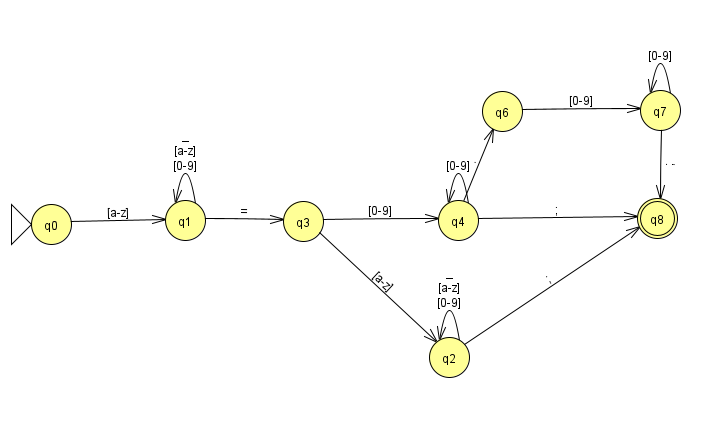

# APS Linguagens Formais e Autômatos

## Dependências

[Java JDK / JRE](https://www.oracle.com/java/technologies/javase/javase-jdk8-downloads.html)

## Executar

### VSCode

Caso tenha o visual studio code, apenas abra o arquivo `src/main/java/AssignmentAutomaton.java` do projeto e aperte F5, para executar.

### Terminal

Dentro da pasta do projeto rode os seguintes comandos:

```shell
javac src/main/java/AssignmentAutomaton.java
java src/main/java/AssignmentAutomaton
```

O comando `javac` compila o projeto e o comando `java` executa o arquivo compilado.


